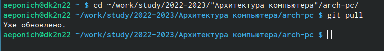

---
## Front matter
title: "Отчёт по лабораторной работе No3. Язык разметки Markdown"
subtitle: "НБИбд-02-22"
author: "Понич Артемий Евгеньевич"

## Generic otions
lang: ru-RU
toc-title: "Содержание"

## Bibliography
bibliography: bib/cite.bib
csl: pandoc/csl/gost-r-7-0-5-2008-numeric.csl

## Pdf output format
toc: true # Table of contents
toc-depth: 2
lof: true # List of figures
lot: true # List of tables
fontsize: 12pt
linestretch: 1.5
papersize: a4
documentclass: scrreprt
## I18n polyglossia
polyglossia-lang:
  name: russian
  options:
	- spelling=modern
	- babelshorthands=true
polyglossia-otherlangs:
  name: english
## I18n babel
babel-lang: russian
babel-otherlangs: english
## Fonts
mainfont: PT Serif
romanfont: PT Serif
sansfont: PT Sans
monofont: PT Mono
mainfontoptions: Ligatures=TeX
romanfontoptions: Ligatures=TeX
sansfontoptions: Ligatures=TeX,Scale=MatchLowercase
monofontoptions: Scale=MatchLowercase,Scale=0.9
## Biblatex
biblatex: true
biblio-style: "gost-numeric"
biblatexoptions:
  - parentracker=true
  - backend=biber
  - hyperref=auto
  - language=auto
  - autolang=other*
  - citestyle=gost-numeric
## Pandoc-crossref LaTeX customization
figureTitle: "Рис."
tableTitle: "Таблица"
listingTitle: "Листинг"
lofTitle: "Список иллюстраций"
lotTitle: "Список таблиц"
lolTitle: "Листинги"
## Misc options
indent: true
header-includes:
  - \usepackage{indentfirst}
  - \usepackage{float} # keep figures where there are in the text
  - \floatplacement{figure}{H} # keep figures where there are in the text
---

# Цель работы

Целью работы является освоение процедуры оформления отчетов с помощью
легковесного языка разметки Markdown

# Задание

1. Откройте терминал
2. Перейдите в каталог курса сформированный при выполнении лаборатор-
ной работы No3:
38 Демидова А. В.
Архитектура ЭВМ
cd ~/work/study/2022-2023/"Архитектура компьютера"/arch-pc/
Обновите локальный репозиторий, скачав изменения из удаленного репози-
тория с помощью команды
git pull
3. Перейдите в каталог с шаблоном отчета по лабораторной работе No 4
cd ~/work/study/2022-2023/"Архитектура
компьютера"/arch-pc/labs/lab04/report↪
4. Проведите компиляцию шаблона с использованием Makefile. Для этого
введите команду
make
При успешной компиляции должны сгенерироваться файлы report.pdf и
report.docx. Откройте и проверьте корректность полученных файлов.
5. Удалите полученный файлы с использованием Makefile. Для этого введите
команду
make clean
Проверьте, что после этой команды файлы report.pdf и report.docx были
удалены.
6. Откройте файл report.md c помощью любого текстового редактора, на-
пример gedit
gedit report.md
Внимательно изучите структуру этого файла.
Демидова А. В. 39
Архитектура ЭВМ
7. Заполните отчет и скомпилируйте отчет с использованием Makefile. Про-
верьте корректность полученных файлов. (Обратите внимание, для кор-
ректного отображения скриншотов они должны быть размещены в ката-
логе image)
8. Загрузите файлы на Github.
cd ~/work/study/2022-2023/"Архитектура компьютера"/arch-pc
git add .
git commit -am 'feat(main): add files lab-4'
git push

# Теоретическое введение

Здесь описываются теоретические аспекты, связанные с выполнением работы.

Например, в табл. [-@tbl:std-dir] приведено краткое описание стандартных каталогов Unix.

: Описание некоторых каталогов файловой системы GNU Linux {#tbl:std-dir}

| Имя каталога | Описание каталога                                                                                                          |
|--------------|----------------------------------------------------------------------------------------------------------------------------|
| `/`          | Корневая директория, содержащая всю файловую                                                                               |
| `/bin `      | Основные системные утилиты, необходимые как в однопользовательском режиме, так и при обычной работе всем пользователям     |
| `/etc`       | Общесистемные конфигурационные файлы и файлы конфигурации установленных программ                                           |
| `/home`      | Содержит домашние директории пользователей, которые, в свою очередь, содержат персональные настройки и данные пользователя |
| `/media`     | Точки монтирования для сменных носителей                                                                                   |
| `/root`      | Домашняя директория пользователя  `root`                                                                                   |
| `/tmp`       | Временные файлы                                                                                                            |
| `/usr`       | Вторичная иерархия для данных пользователя                                                                                 |

Более подробно об Unix см. в [@gnu-doc:bash;@newham:2005:bash;@zarrelli:2017:bash;@robbins:2013:bash;@tannenbaum:arch-pc:ru;@tannenbaum:modern-os:ru].

# Выполнение лабораторной работы

1) Переходим в каталог курса сформированный при выполнении лабораторной работы No3 и обновляем локальный репозиторий, скачав изменения из удаленного репозитория с помощью команды git pull(рис. [-@fig:001])

{ #fig:001 width=90% }

2) Перейдём в каталог с шаблоном отчета по лабораторной работе No 3(рис. [-@fig:002])

{ #fig:002 width=90% }

3) Проведём компиляцию шаблона с использованием Makefile. Для этого
вводим команду make.При успешной компиляции должны сгенерироваться файлы report.pdf и
report.docx. Открыл и проверил корректность полученных файлов.(рис. [-@fig:003])

{ #fig:003 width=90% }

4) Удаляем полученный файлы с использованием Makefile. Для этого вводим
команду make clean.Проверил, что после этой команды файлы report.pdf и report.docx были
удалены.(рис. [-@fig:004])

{ #fig:004 width=90% }

5) Открываем файл report.md c помощью любого текстового редактора, на-
пример gedit:gedit report.md(рис. [-@fig:005])

{ #fig:005 width=90% }

6) Заполняю отчет и скомпилирую отчет с использованием Makefile. Проверил корректность полученных файлов. (рис. [-@fig:006])

{ #fig:006 width=90% }

# Выводы

Освоил процедуры оформления отчётов с помощью легковесного языка разметки Markdown.

# Список литературы{.unnumbered}

::: {#refs}
:::
