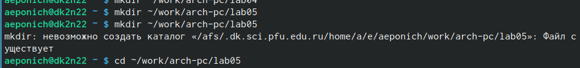
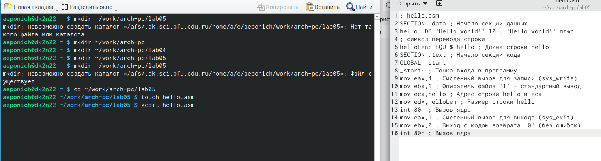
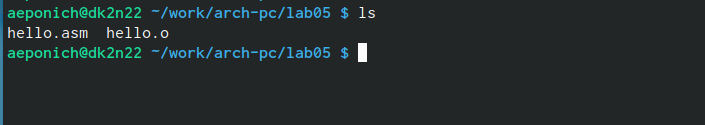
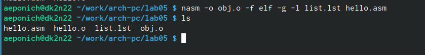
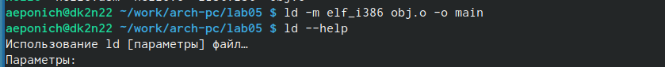
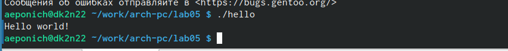
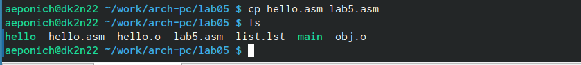
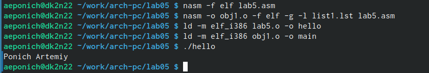

---
## Front matter
title: "Лабораторная работа №4"
subtitle: "Создание и процесс обработки программ на языке ассемблера NASM"
author: "Понич Артемий Евгеньевич"

## Generic otions
lang: ru-RU
toc-title: "Содержание"

## Bibliography
bibliography: bib/cite.bib
csl: pandoc/csl/gost-r-7-0-5-2008-numeric.csl

## Pdf output format
toc: true # Table of contents
toc-depth: 2
lof: true # List of figures
lot: true # List of tables
fontsize: 12pt
linestretch: 1.5
papersize: a4
documentclass: scrreprt
## I18n polyglossia
polyglossia-lang:
  name: russian
  options:
	- spelling=modern
	- babelshorthands=true
polyglossia-otherlangs:
  name: english
## I18n babel
babel-lang: russian
babel-otherlangs: english
## Fonts
mainfont: PT Serif
romanfont: PT Serif
sansfont: PT Sans
monofont: PT Mono
mainfontoptions: Ligatures=TeX
romanfontoptions: Ligatures=TeX
sansfontoptions: Ligatures=TeX,Scale=MatchLowercase
monofontoptions: Scale=MatchLowercase,Scale=0.9
## Biblatex
biblatex: true
biblio-style: "gost-numeric"
biblatexoptions:
  - parentracker=true
  - backend=biber
  - hyperref=auto
  - language=auto
  - autolang=other*
  - citestyle=gost-numeric
## Pandoc-crossref LaTeX customization
figureTitle: "Рис."
tableTitle: "Таблица"
listingTitle: "Листинг"
lofTitle: "Список иллюстраций"
lotTitle: "Список таблиц"
lolTitle: "Листинги"
## Misc options
indent: true
header-includes:
  - \usepackage{indentfirst}
  - \usepackage{float} # keep figures where there are in the text
  - \floatplacement{figure}{H} # keep figures where there are in the text
---

# Цель работы

Освоение процедуры компиляции и сборки программ, написанных на ассем-
блере NASM.

# Задание

Рассмотрим пример простой программы на языке ассемблера NASM. Тради-
ционно первая программа выводит приветственное сообщение Hello world!
на экран.
Создайте каталог для работы с программами на языке ассемблера NASM

Перейдите в созданный каталог

Создайте текстовый файл с именем hello.asm

откройте этот файл с помощью любого текстового редактора, например, gedit
и введите в него следующий текст.

В отличие от многих современных высокоуровневых языков программирова-
ния, в ассемблерной программе каждая команда располагается на отдельной
строке. Размещение нескольких команд на одной строке недопустимо. Син-
таксис ассемблера NASM является чувствительным к регистру, т.е. есть разница
между большими и малыми буквами.

NASM превращает текст программы в объектный код. Например, для компиля-
ции приведённого выше текста программы «Hello World» необходимо написать:nasm -f elf hello.asm

Если текст программы набран без ошибок, то транслятор преобразует текст
программы из файла hello.asm в объектный код, который запишется в файл
hello.o. Таким образом, имена всех файлов получаются из имени входного
файла и расширения по умолчанию. При наличии ошибок объектный файл не
создаётся, а после запуска транслятора появятся сообщения об ошибках или
предупреждения.
С помощью команды ls проверьте, что объектный файл был создан. Какое
имя имеет объектный файл?
NASM не запускают без параметров. Ключ -f указывает транслятору, что тре-
буется создать бинарные файлы в формате ELF. Следует отметить, что формат
elf64 позволяет создавать исполняемый код, работающий под 64-битными вер-
сиями Linux. Для 32-битных версий ОС указываем в качестве формата просто
elf.
NASM всегда создаёт выходные файлы в текущем каталоге.

Полный вариант командной строки nasm выглядит следующим образом:
nasm [-@ косвенный_файл_настроек] [-o объектный_файл] [-f
формат_объектного_файла] [-l листинг] [параметры...] [--]
исходный_файл

Выполните следующую команду:
nasm -o obj.o -f elf -g -l list.lst hello.asm
Данная команда скомпилирует исходный файл hello.asm в obj.o (опция -
o позволяет задать имя объектного файла, в данном случае obj.o), при этом
формат выходного файла будет elf, и в него будут включены символы для
отладки (опция -g), кроме того, будет создан файл листинга list.lst (опция
-l).

С помощью команды ls проверьте, что файлы были созданы.
Для более подробной информации см. man nasm. Для получения списка фор-
матов объектного файла см. nasm -hf.

Как видно из схемы на рис. 4.3, чтобы получить исполняемую программу,
объектный файл необходимо передать на обработку компоновщику:
ld -m elf_i386 hello.o -o hello
С помощью команды ls проверьте, что исполняемый файл hello был создан.
Компоновщик ld не предполагает по умолчанию расширений для файлов, но
принято использовать следующие расширения:
• o – для объектных файлов;
• без расширения – для исполняемых файлов;
• map – для файлов схемы программы;
• lib – для библиотек.
Ключ -o с последующим значением задаёт в данном случае имя создаваемого
исполняемого файла.
Выполните следующую команду:
ld -m elf_i386 obj.o -o main
Какое имя будет иметь исполняемый файл? Какое имя имеет объектный файл
из которого собран этот исполняемый файл?
Формат командной строки LD можно увидеть, набрав ld --help. Для получе-
ния более подробной информации см. man ld.

Запустить на выполнение созданный исполняемый файл, находящийся в
текущем каталоге, можно, набрав в командной строке:
./hello

1. В каталоге ~/work/arch-pc/lab05 с помощью команды cp создайте копию
файла hello.asm с именем lab5.asm
2. С помощью любого текстового редактора внесите изменения в текст про-
граммы в файле lab5.asm так, чтобы вместо Hello world! на экран выво-
дилась строка с вашими фамилией и именем.
3. Оттранслируйте полученный текст программы lab5.asm в объектный
файл. Выполните компоновку объектного файла и запустите получивший-
ся исполняемый файл.
4. Скопируйте файлы hello.asm и lab5.asm в Ваш локальный репозиторий
в каталог ~/work/study/2022-2023/"Архитектура компьютера"/arch-
pc/labs/lab05/. Загрузите файлы на Github.

# Теоретическое введение

Здесь описываются теоретические аспекты, связанные с выполнением работы.

Например, в табл. [-@tbl:std-dir] приведено краткое описание стандартных каталогов Unix.

: Описание некоторых каталогов файловой системы GNU Linux {#tbl:std-dir}

| Имя каталога | Описание каталога                                                                                                          |
|--------------|----------------------------------------------------------------------------------------------------------------------------|
| `/`          | Корневая директория, содержащая всю файловую                                                                               |
| `/bin `      | Основные системные утилиты, необходимые как в однопользовательском режиме, так и при обычной работе всем пользователям     |
| `/etc`       | Общесистемные конфигурационные файлы и файлы конфигурации установленных программ                                           |
| `/home`      | Содержит домашние директории пользователей, которые, в свою очередь, содержат персональные настройки и данные пользователя |
| `/media`     | Точки монтирования для сменных носителей                                                                                   |
| `/root`      | Домашняя директория пользователя  `root`                                                                                   |
| `/tmp`       | Временные файлы                                                                                                            |
| `/usr`       | Вторичная иерархия для данных пользователя                                                                                 |

Более подробно об Unix см. в [@gnu-doc:bash;@newham:2005:bash;@zarrelli:2017:bash;@robbins:2013:bash;@tannenbaum:arch-pc:ru;@tannenbaum:modern-os:ru].

# Выполнение лабораторной работы

Создаю каталог для работы с программами на языке ассемблера NASM и перехожу в созданный каталог.(рис. [-@fig:001])

{ #fig:001 width=90% }

Создаю текстовый файл с именем hello.asm и открываю этот файл с помощью любого текстового редактора, например, gedit. Ввожу в него следующий текст:
; hello.asm
SECTION .data ; Начало секции данных
hello: DB 'Hello world!',10 ; 'Hello world!' плюс
; символ перевода строки
helloLen: EQU $-hello ; Длина строки hello
SECTION .text ; Начало секции кода
GLOBAL _start
_start: ; Точка входа в программу
mov eax,4 ; Системный вызов для записи (sys_write)
mov ebx,1 ; Описатель файла '1' - стандартный вывод
mov ecx,hello ; Адрес строки hello в ecx
mov edx,helloLen ; Размер строки hello
int 80h ; Вызов ядра
mov eax,1 ; Системный вызов для выхода (sys_exit)
mov ebx,0 ; Выход с кодом возврата '0' (без ошибок)
int 80h ; Вызов ядра
(рис. [-@fig:002])

{ #fig:002 width=90% }

Для компиляции приведённого выше текста программы «Hello World» необходимо написать:nasm -f elf hello.asm.С помощью команды ls проверю, что объектный файл был создан.(рис. [-@fig:003])

{ #fig:003 width=90% }

Выполняю следующую команду:
nasm -o obj.o -f elf -g -l list.lst hello.asm (рис. [-@fig:004])

{ #fig:004 width=90% }

Чтобы получить исполняемую программу,
объектный файл необходимо передать на обработку компоновщику:
ld -m elf_i386 hello.o -o hello
С помощью команды ls проверю, что исполняемый файл hello был создан.(рис. [-@fig:005])

{ #fig:005 width=90% }

Выполню следующую команду:
ld -m elf_i386 obj.o -o main (рис. [-@fig:006])

{ #fig:006 width=90% }

Запускаю на выполнение созданный исполняемый файл, находящийся в
текущем каталоге,набрав в командной строке:
./hello(рис. [-@fig:007])

{ #fig:007 width=90% }

В каталоге ~/work/arch-pc/lab05 с помощью команды cp создаю копию
файла hello.asm с именем lab5.asm.(рис. [-@fig:008])

{ #fig:008 width=90% }

С помощью любого текстового редактора внесу изменения в текст программы в файле lab5.asm так, чтобы вместо Hello world! на экран выводилась строка с моей фамилией и именем.
Оттранслирую полученный текст программы lab5.asm в объектный
файл. Выполню компоновку объектного файла и запущу получивший-
ся исполняемый файл.(рис. [-@fig:010])

{ #fig:010 width=90% }

# Выводы

Освоил процедуры компиляции и сборки программ, написанных на ассем-
блере NASM.

# Список литературы{.unnumbered}

::: {#refs}
:::
